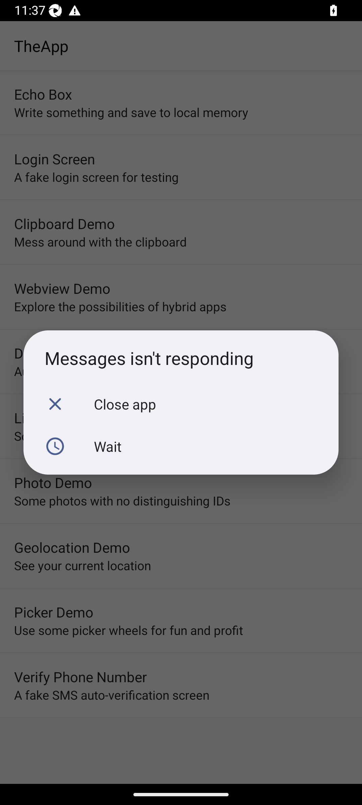

# Documentation Screenshots

These lightweight previews show what a reviewer should expect from the framework.

Refresh these previews from real framework outputs. Prefer device-free helper/report runs and
generated core reports for stable screenshots, then add real Appium sample artifacts when an
emulator, simulator, or device is available. Do not use mock app states or edited failure artifacts
as replacements for captured framework output.

## CI Validation

## HTML Report

## Walkthrough Report

## Walkthrough Artifact

## Helper Catalog

